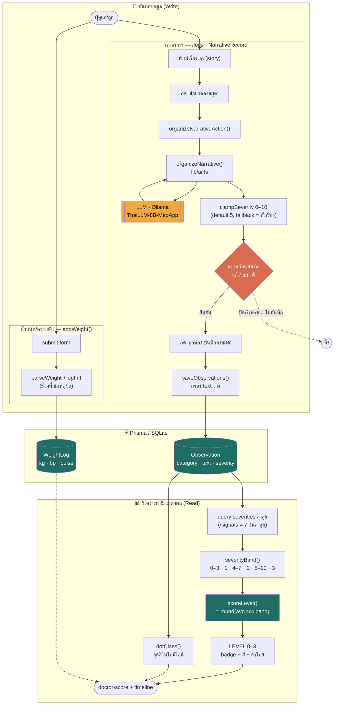

# Record System Flow — หมอนำทาง

แผนภาพการทำงานของระบบบันทึก (Observation + WeightLog) และการคิดคะแนน doctor-score.

## หลักการที่แผนภาพสะท้อน

- **AI ไม่ auto-save** — ถ้าไม่กด "ถูกต้อง บันทึกลงสมุด" ข้อมูลอยู่แค่ `useState` แล้วหายไป
- **LLM แตะแค่ severity รายข้อ (0–10)** — การรวมคะแนน (`severityBand` → `scoreLevel`) เป็น deterministic code ไม่ผ่านโมเดล (AGENTS.md rule 2)
- **น้ำหนัก/ความดัน** บันทึกจังหวะเดียว ไม่มีขั้นตรวจทาน

## ไฟล์อ้างอิง

| ส่วน | ไฟล์ |
|------|------|
| ฟอร์ม/ตรวจทาน | `app/logs/narrative-record.tsx` |
| server actions | `app/logs/actions.ts` |
| เรียกโมเดล + clamp | `lib/ai.ts` |
| คิดคะแนน/แบ่งแถบสี | `lib/severity.ts` |
| แสดง doctor-score | `app/page.tsx`, `app/signals/page.tsx` |
